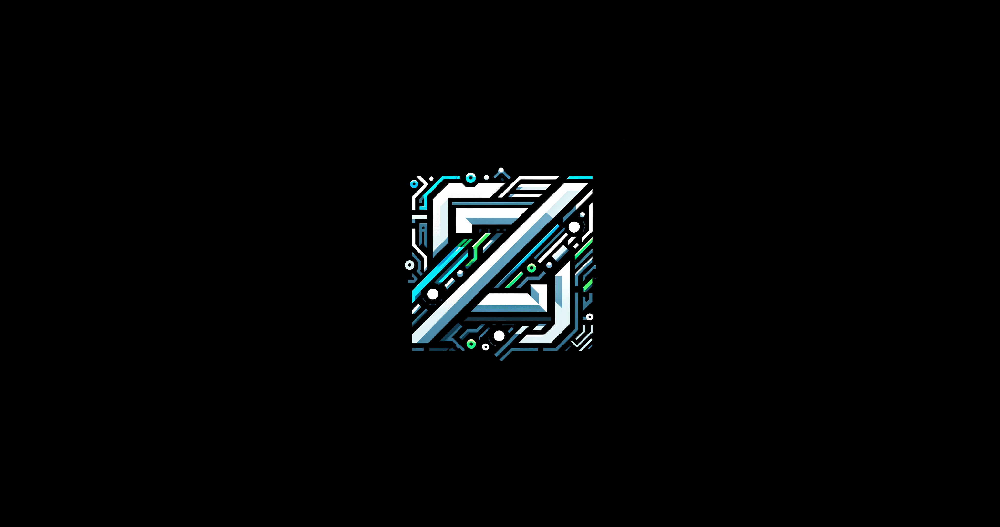
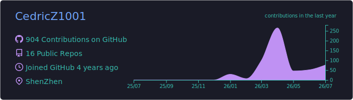
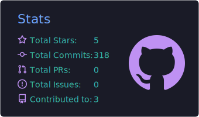
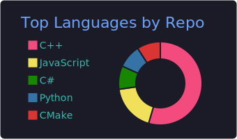
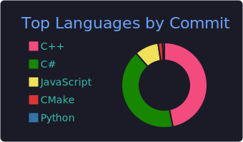
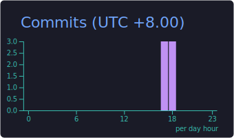

<div align="center">

<!-- Waving Header -->


<!-- Logo -->


<!-- Typing SVG -->
<a href="https://git.io/typing-svg">
  
</a>

<br/>


</div>

---

## `> whoami`

```yaml
name: CedricZ1001
role: UE Technical Artist & AI Agent Developer
location: ~
focus:
  - Unreal Engine Technical Art Pipeline
  - UE AI Agent Development
  - Game Development & Immersive Experiences
  - Graphics Programming (HLSL / DirectX 12)
motto: "Bridging the gap between Art and Engineering"
```

---

## Tech Stack

<div align="center">

**Engine & Graphics**


**Languages**


**Tools & DCC**


**AI & ML**


</div>

---

## GitHub Stats

<!-- Profile Details - generated by GitHub Actions -->
<div align="center">
  
</div>

<br/>

<!-- Stats + Streak side by side -->
<div align="center">
  
  
</div>

<br/>

<!-- Language cards side by side -->
<div align="center">
  
  
</div>

<br/>

<!-- Productive Time -->
<div align="center">
  
</div>

---

## Activity

[](https://github.com/ashutosh00710/github-readme-activity-graph)

---

<div align="center">

### Let's Connect

[](mailto:Cedric1001Z@gmail.com)
[](https://github.com/CedricZ1001)

<br/>

<!-- Waving Footer -->


</div>
