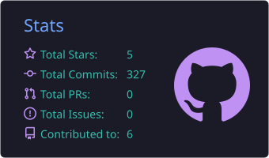
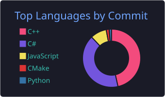

### Cedric Z &nbsp;·&nbsp; 陈智威

**Technical Artist × AI Agent Engineer**

*Turning the non-deterministic output of LLMs into deterministic, reliable systems inside a game engine.*

  <a href="mailto:Cedric1001Z@gmail.com">Email</a> &nbsp;·&nbsp;
  <a href="https://github.com/CedricZ1001?tab=repositories">Repositories</a>

---

## About

Four years in technical art, the last of them spent building an **AI coding agent for Unreal Engine** — and then using it to ship a real game.

Most people in this space sit on one side of the line: engine folks who can't build an agent runtime, or AI engineers who've never touched a production art pipeline. I work on both ends of the same problem — wrapping engine capability into a tool surface an agent can actually use, and making the agent reliable enough that a shipping team trusts it.

The recurring lesson: **whether an engine capability can be used by an AI has almost nothing to do with how well the tool itself is written.** Tool descriptions, routing rules, and gating design are what decide it.

---

## Focus

**`Agent Engineering`**
Tool-surface design over engine APIs · progressive tool disclosure · context & cost engineering (compression, prompt-cache boundaries, result offloading & recall) · multi-model routing · execution contracts and risk-tiered approval gates · MCP servers

**`Technical Art`**
UE5 materials & master-material architecture · Niagara VFX · stylized rendering · performance profiling & GPU pass analysis · DCC ↔ engine toolchains (Blender / Substance Painter) · art asset specs and pipeline design

**`Graphics & Engine`**
HLSL · source-level UE modification, custom Shading Models · rendering pipeline, post-processing, PBR / IBL, SDF · a DX12 renderer with an RHI abstraction layer, written from scratch

**`Generative AI in Production`**
Text-to-image / image-to-3D pipelines (Tripo, Meshy, Hunyuan) · consistency specs that turn *"looks right"* into *"is actually usable in-engine"* · automated generate → engine-ready asset paths

---

## Selected Work

**Creatour** — *AI coding agent desktop product for UE5* · core developer
An agent runtime (Electron) driving a UE5 editor plugin tool layer (C++) through a WebSocket tool channel, with a Python interface layer. The agent doesn't just write code — it operates the editor, launches PIE, and verifies its own changes. Used as the team's primary AI development tool on a shipping title, across C++ / Blueprint / material / level work. Supports UE 5.3 through 5.8 with per-version prebuilt releases; exposes an MCP server for third-party agents.

**《麦琪的花园》/ Maggie's Garden** — *2D pixel-art game, fully AI-generated assets* · technical artist
UE5, releasing on Steam in August 2026. Pixel-art consistency spec (palette, resolution, pivot, alpha edges) pushed upstream into the generation stage; master-material decomposition; full 2D top-down lighting solution and global pixel-perfect rendering.

**Nexus** — *anime-stylized shooter* · technical artist
Source-level UE5.2 modification adding a custom Shading Model, packaged and distributed to the team; later re-implemented in the material system for maintainability. SDF facial shadows, CurveAtlas ramps, single-channel ID maps, screen-space depth rim light, stencil-based brow overlay, and a Substance Painter shader matching UE output at texture-authoring time.

---

## Toolchain

---

