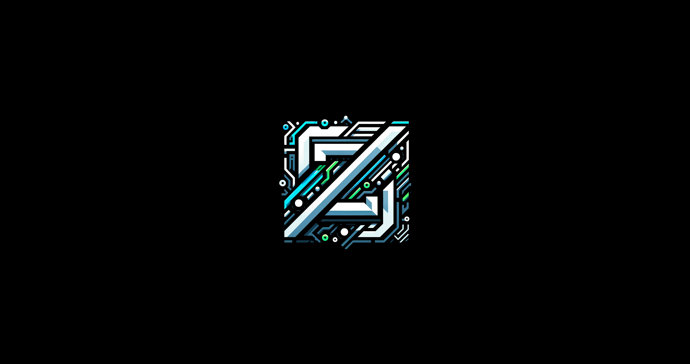
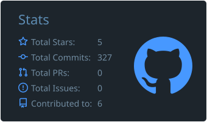
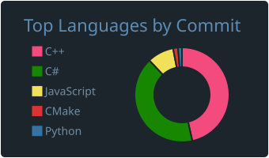

---

**`Agent Engineering`** · tool-surface design over engine APIs · progressive tool disclosure · context & cost engineering · reliability gates · MCP

**`Technical Art`** · UE5 materials · Niagara VFX · stylized rendering · performance profiling · DCC ↔ engine toolchains

**`Graphics`** · HLSL · custom shading models · PBR / IBL · SDF · post-processing · DirectX 12

**`Generative AI`** · text-to-image / image-to-3D · consistency specs · engine-side asset pipelines

---

---

<picture>
  <source media="(prefers-color-scheme: dark)" srcset="https://raw.githubusercontent.com/CedricZ1001/CedricZ1001/output/snake-dark.svg" />
  <source media="(prefers-color-scheme: light)" srcset="https://raw.githubusercontent.com/CedricZ1001/CedricZ1001/output/snake.svg" />
  
</picture>

  

  

<a href="mailto:Cedric1001Z@gmail.com">Cedric1001Z@gmail.com</a>

